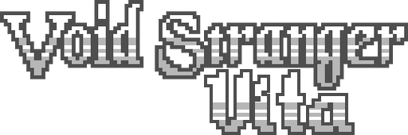
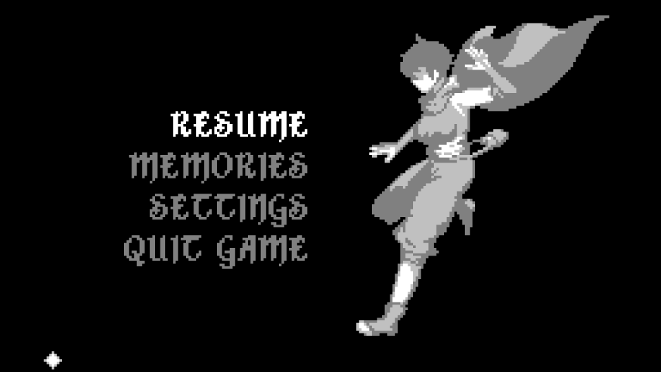

<p align="center">
  
</p>

# Void Stranger Vita

An unofficial native port of **Void Stranger 1.1.3** for PlayStation Vita.

The project runs the original Windows/Steam GameMaker data through a customized
[Butterscotch](https://github.com/ButterscotchRunner/Butterscotch) runtime, with
[VitaGL](https://github.com/Rinnegatamante/vitaGL) rendering, Vita controls and
prepared BC3/RGBA4444 texture caches.

> This repository does not contain Void Stranger's commercial game data. Buy
> and obtain the original game before using this port.


## Status

The game boots and is playable on PS Vita. The port currently includes:

- native 960x544 presentation;
- Vita physical controls;
- audio through OpenAL;
- animated loading screen;
- optimized `data.win` support;
- prepared BC3/DXT5 and RGBA4444 texture caches;
- diagnostic log at `ux0:data/voidstranger/butterscotch-probe.log`;
- EN, FI, ES, FR and IT language support through
  [Void Stranger International](https://github.com/GiAnMMV/Void-Stranger-International).

Further full-game hardware testing and performance work are still in progress.

## Requirements

- A legally obtained Steam copy of **Void Stranger 1.1.3**;
- `kubridge.skprx`;
- `libshacccg.suprx`;
- `fd_fix.skprx` (do not use it together with rePatch).

## Installation

1. Prepare the official Steam files with the scripts in this repository.
2. Copy the generated `voidstranger` folder to `ux0:data/voidstranger/`.
3. Install `VoidStranger.vpk` with VitaShell.

The final data layout is:

```text
ux0:data/voidstranger/
├── data.win
├── audiogroup1.dat
├── audiogroup2.dat
├── voidstranger_data.csv
├── Languages/
├── texture-cache/
└── pvr/
```

Save files are created under `ux0:data/voidstranger/saves/`.

## Screenshots

<p align="center">
  
  
</p>

## Building

Install Docker Desktop with Linux containers enabled, place the official game
files in `data/Void.Stranger.v1.1.3/`, then run:

```powershell
powershell -ExecutionPolicy Bypass -File .\scripts\prepare-voidstranger-data.ps1
.\run_build.cmd
```

The VPK is generated at `artifacts/VoidStranger.vpk`. Copy the prepared data
from `data/prepared/voidstranger/` to the Vita separately.

The build uses VitaSDK through Docker and compiles VitaGL with
`NO_SPLASHSCREEN=1`. The title ID is `VSTR00001`.

## Credits

- [System Erasure](https://store.steampowered.com/app/2121980/Void_Stranger/) — Void Stranger;
- [Butterscotch](https://github.com/ButterscotchRunner/Butterscotch);
- [VitaGL](https://github.com/Rinnegatamante/vitaGL);
- [Void Stranger International](https://github.com/GiAnMMV/Void-Stranger-International);
- [YoYo Loader Vita compatibility research](https://github.com/Rinnegatamante/YoYo-Loader-Vita-Compatibility/issues/1121);
- [sinister-kid/voidstranger_vita](https://github.com/sinister-kid/voidstranger_vita).

Void Stranger and its assets belong to their respective owners. This is a
community-made project and is not affiliated with System Erasure.
