<p align="center">
  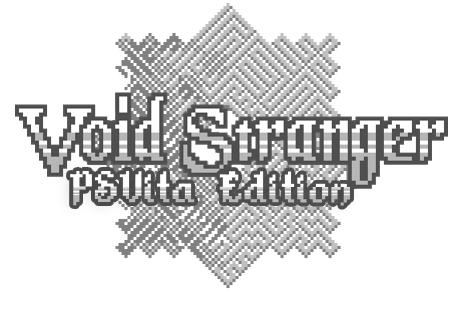
</p>
<p align="center">
  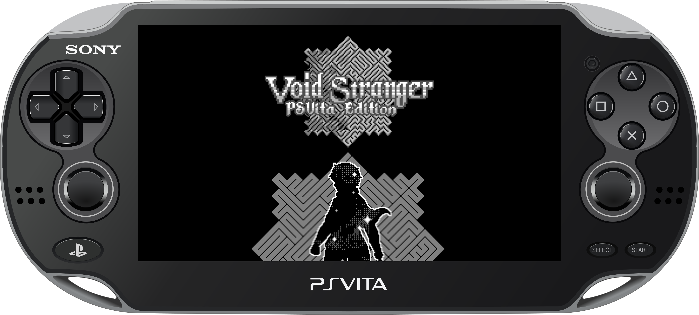
</p>

An _unofficial_ native port of **Void Stranger 1.1.3** for the PlayStation Vita.

The project runs the original Windows/Steam GameMaker data through a customized version of [Butterscotch](https://github.com/ButterscotchRunner/Butterscotch), with rendering provided by [VitaGL](https://github.com/Rinnegatamante/vitaGL). The Vita port includes native controls, multilingual support, Vita-specific graphics options, palette/tone control, runtime texture caching, native startup video playback, native trophies and optimized audio.

> This repository and its releases do not include the complete commercial game data. A legitimate Steam copy of **Void Stranger 1.1.3** is required.

## Project Status

<div align="center">
  <a href="https://github.com/WolffsRoom/VoidStrangerVita/releases"></a>
  <a href="https://github.com/WolffsRoom/VoidStrangerVita/releases/latest"></a>
  <br>
  
  
  
</div>

## v2.0 Preview

### Native loading and cache generation

<p align="center">
  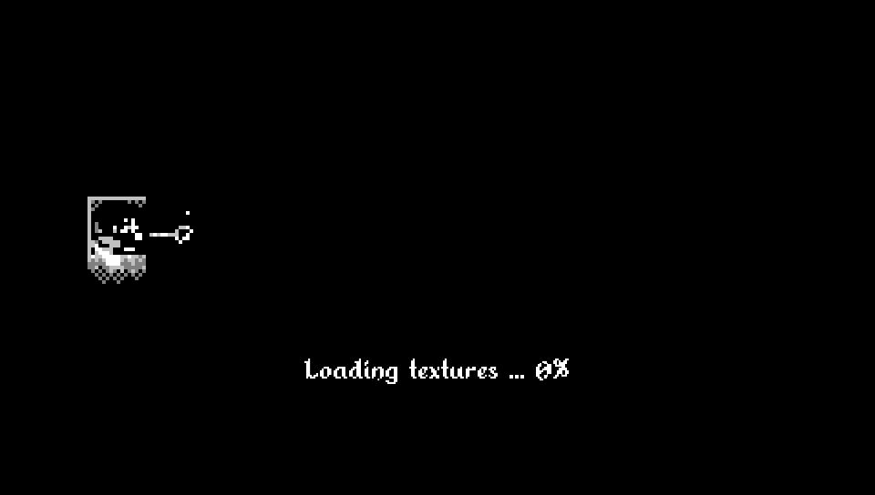
</p>

The first boot prepares the Vita-side texture cache from the active game data. Later boots reuse the generated cache.

### Sera installation assistant

<p align="center">
  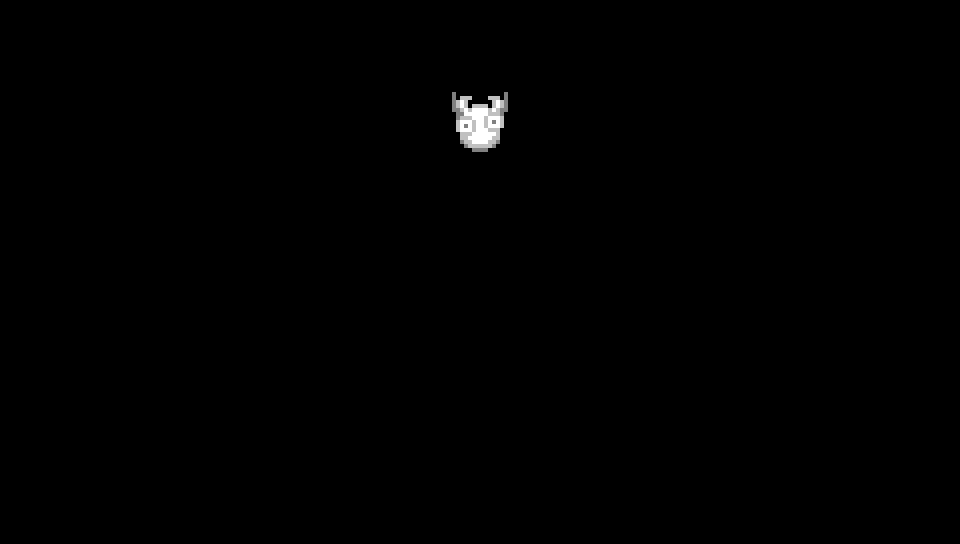
</p>

When required data is missing or misplaced, the v2.0 assistant checks `ux0:data/voidstranger/`, helps organize unambiguous files and points the player to the patcher when a clean data set is required.

<div align="center">

### Support this and other projects
If you enjoy my work, consider supporting the development!

[](https://www.buymeacoffee.com/5rsrt7j4z8f)

</div>

<br>

## Installation Guide

### Requirements

- A legally obtained Steam copy of **Void Stranger 1.1.3**;
- [kubridge](https://github.com/TheOfficialFloW/kubridge/releases/) (`kubridge.skprx`);
- [FdFix](https://github.com/TheOfficialFloW/FdFix/releases/) (`fd_fix.skprx`), unless you use rePatch;
- `libshacccg.suprx` installed on the Vita.
- [NoTrpDrm](https://github.com/Rinnegatamante/NoTrpDrm) (`NoTrpDrm.suprx`) for native trophy registration.

Add the kernel plugins to `ux0:tai/config.txt` under `*KERNEL`:

```text
*KERNEL
ux0:tai/kubridge.skprx
ux0:tai/fd_fix.skprx
```

> [!NOTE]
> Do not install `fd_fix.skprx` together with rePatch.

### HOW TO APPLY THE PATCH:

The **Void Stranger Vita Patcher v2.0** requires an official, unmodified Steam installation of **Void Stranger 1.1.3**.

1. Purchase and install [Void Stranger on Steam](https://store.steampowered.com/app/2121980/Void_Stranger/).
2. Download `VoidStranger-v2.0.vpk` and `Void Stranger Vita Patcher v2.0.zip` from the [latest release](https://github.com/WolffsRoom/VoidStrangerVita/releases/latest).
3. Extract the patcher ZIP and run `VoidStrangerVitaPatcher.exe`.
4. Select or drag the official Steam `Void Stranger` installation folder when requested.
5. Choose an output directory and wait for the patcher to generate the `voidstranger` folder.
6. Copy the generated `voidstranger` folder to `ux0:data/` on the PS Vita.
7. Install `VoidStranger-v2.0.vpk` using VitaShell.
8. Start the game. On the **first boot**, the Vita generates its BC3/RGBA4444 texture cache automatically. This first startup can take longer than subsequent boots.

> [!IMPORTANT]
> Do **not** copy old `pvr/` or `texture-cache/` folders from previous builds. Current releases generate these caches directly on the Vita from the active `data.win`.

Before the first boot, the generated data should look similar to:

```text
ux0:data/voidstranger/
|-- data.win
|-- audiogroup1.dat
|-- audiogroup2.dat
|-- voidstranger_data.csv
|-- options.ini
|-- splash.png
|-- intro/
|   |-- IntroVoidStranger.mp4
|   |-- LongVideo.mp4
|   `-- skip.png
`-- Languages/
    |-- EN/
    |-- FI/
    |-- ES/
    |-- FR/
    |-- IT/
    `-- PTBR/
```

After the first boot, the Vita creates its own `pvr/`, `texture-cache/` and save-related files as needed.

### v2.0 installation assistant

If one or more required files are not in the root of `ux0:data/voidstranger/`, v2.0 also checks its subfolders recursively. When every missing required file is found exactly once, Sera offers to move them into the correct location automatically. The port never overwrites an existing destination file and never auto-fixes an ambiguous layout with duplicate candidates; those cases are left for manual review.

If the GameMaker data file was accidentally renamed (for example `dataa.win`), the assistant can recognize a unique `.win` candidate by its GameMaker FORM header, normalize it to `data.win`, and then validate it against the expected v2.0 SHA-256 (9CE2BAB66D6EDB3FB6506BEDEFC634BCB354AD034D828F8BA3DC679777C6E00A). A file with the correct name but an incompatible hash is treated as a version/data problem rather than an organization problem.

After normalization, the runner verifies `data.win` against the exact patched build expected by this release. A unique `.win` file is only considered for normalization when it has the GameMaker `FORM` header; if its SHA-256 does not match v2.0 afterwards, the file remains rejected as incompatible and the game does not continue with it.

The installation dialogue now follows the original Sera presentation more closely: Alkhemikal text is revealed character by character in line order, commas introduce the original-style pause, and the portrait changes between neutral, happy and sigh states according to the result of the interaction. The original `snd_lev.wav` remains packaged, but the pre-data voice backend is still being validated separately so audio initialization cannot block or crash the assistant.

If the required data is genuinely missing, the in-game assistant explains that a legitimate Steam copy and the Vita Patcher are required, displays the project QR code, reminds the user to place the generated files in `ux0:data/voidstranger`, fades to black and exits cleanly.

## Supported Languages

| Language | Code |
| :--- | :---: |
| English | EN |
| Finnish / Suomi | FI |
| Spanish / Español | ES |
| French / Français | FR |
| Italian / Italiano | IT |
| Brazilian Portuguese / Português do Brasil | PTBR |

The multilingual implementation is based on work from [Void Stranger International](https://github.com/GiAnMMV/Void-Stranger-International), with Vita-specific integration and Brazilian Portuguese support included in the patcher.

## Control Layout

The Vita build uses the controller graphics stored in `assets/controls/`, matching the visual language used by the in-game controller reference.

<p align="center">
  
  
  
  
  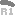
  
  
  
</p>
<p align="center">
  
  
  
  
  
  
  
  
</p>

| PS Vita | Action |
| :--- | :--- |
| D-Pad / Left Stick | Move / navigate |
| Cross | Action / confirm |
| Circle or Square | Secondary action / cancel |
| Triangle | Menu / original `C` action |
| Start | Enter / pause / resume |
| Select | Escape / back |
| L | Original Page Down action |
| R | Original Page Up action |

The in-game **Settings > Graphics** menu includes VSync, FPS mode, brightness, Stretch Screen and the original palette/tone presets. The obsolete desktop Scaling entry is hidden on Vita.

### Touch support

The front touchscreen is used contextually rather than replacing the physical controls. In v2.0:

- menus and the in-game trophy browser accept touch input for selection and scrolling;
- the special fruit/orange interaction can be confirmed by a fresh touch on the front panel when `obj_orange.can_eat` is active;
- that fruit touch behaves like a single **Cross** press and intentionally does not auto-repeat while the screen is held;
- normal movement and regular gameplay remain on the Vita buttons, D-Pad and analog stick.

## PS Vita Manual

The VPK includes an eleven-page PS Vita manual. Small previews are shown below; the source pages live in `assets/manual/manual/`.

<p align="center">
  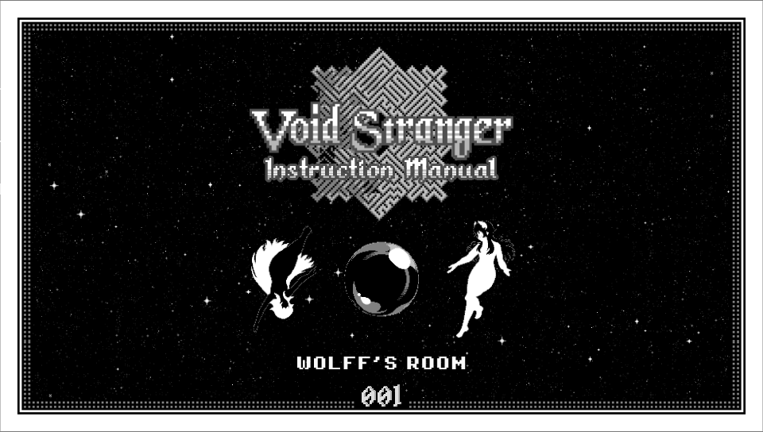
  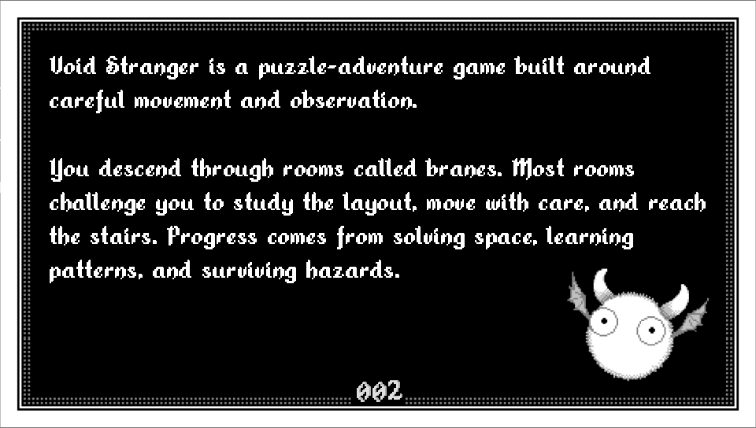
  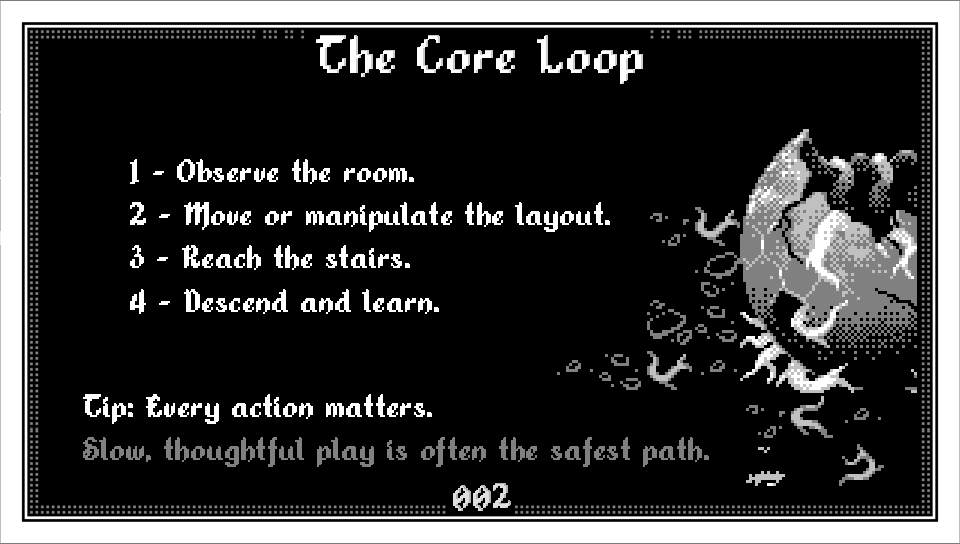
  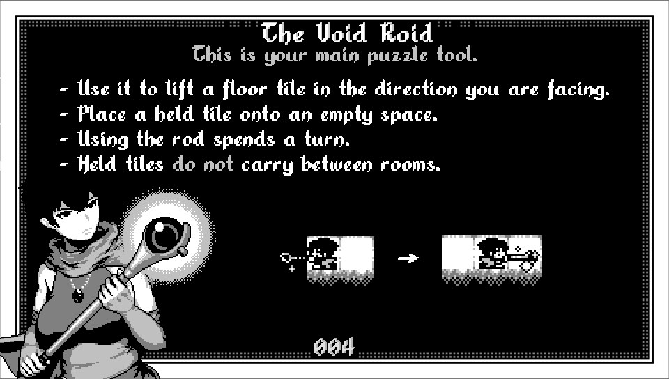
  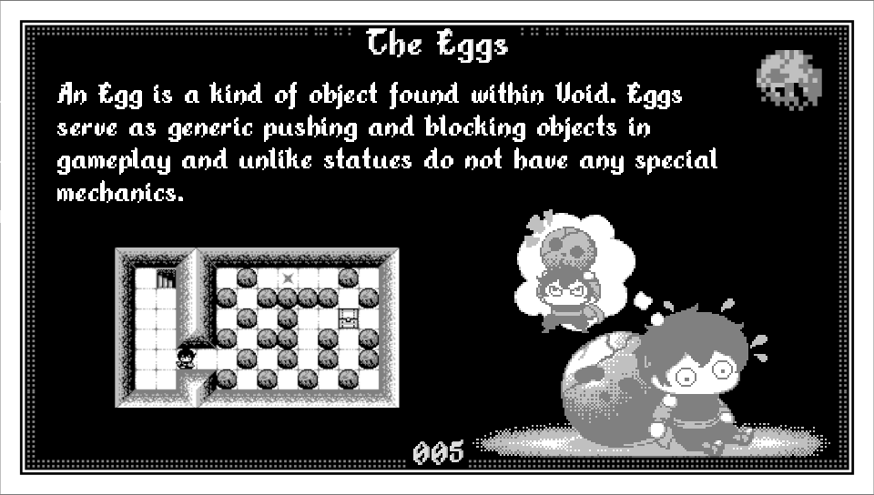
</p>
<p align="center">
  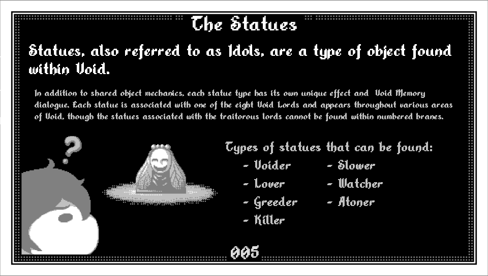
  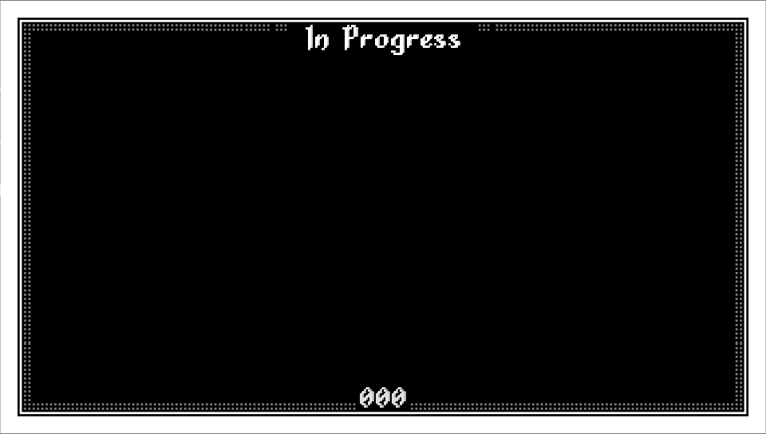
  
  
  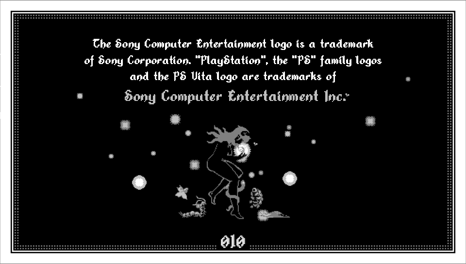
  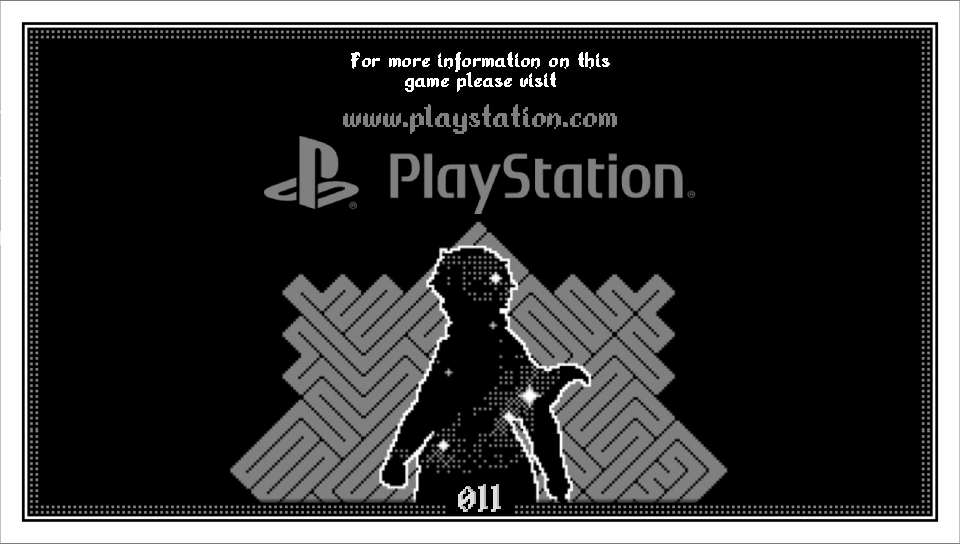
</p>

## Native Trophies

Void Stranger Vita v2.0 includes a **30-entry trophy catalog**, an in-game trophy browser and unlock notifications, together with native PS Vita trophy support through communication ID `VSTR00001_00`. Existing local unlocks are reconciled with the native trophy database on boot.

Some Vita-side triggers include:

| Trophy / event | Trigger |
| :--- | :--- |
| **The Long Way** | Watch the long startup movie |
| **Cut to the Chase** | Skip the long startup movie |
| **First Steps** | Make the first movement |
| **First Descent** | Complete the first room transition |
| **Memory Lane** | Open the Memories album |
| Game achievement sync | Original game progress, including `VS_PENDANT`, is merged into the Vita trophy state |

Additional port events also track Vita-specific actions such as changing palette/tone and Stretch Screen settings. Trophy progress can be reviewed from the in-game Vita settings interface.

`NoTrpDrm` is required for the native trophy pack to register correctly on compatible real PS Vita firmware.

### NoTrpDrm setup

1. Download `NoTrpDrm.suprx` from the [NoTrpDrm releases](https://github.com/Rinnegatamante/NoTrpDrm/releases).
2. Copy it to the taiHEN directory used by your Vita (`ur0:tai/` is recommended when that is your active configuration).
3. Add it under `*main` in the active `config.txt`:

```text
*main
ur0:tai/NoTrpDrm.suprx
```

If your active taiHEN configuration is on `ux0:tai/`, use `ux0:tai/NoTrpDrm.suprx` instead. Reboot the Vita or reload taiHEN afterwards.

> [!IMPORTANT]
> The NoTrpDrm implementation used by this project targets retail firmware **3.60 through 3.68**. Firmware spoofing does not change the console's underlying firmware. Treat this custom trophy set as homebrew/local data and do not attempt to synchronize it with PSN.

## Screenshots

<p align="center">
  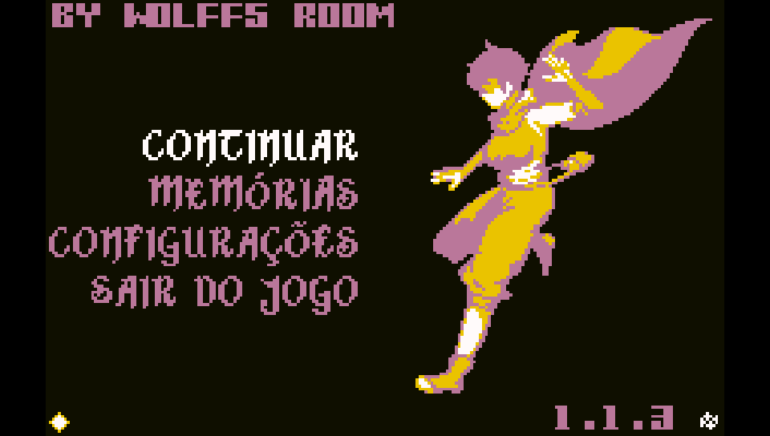
  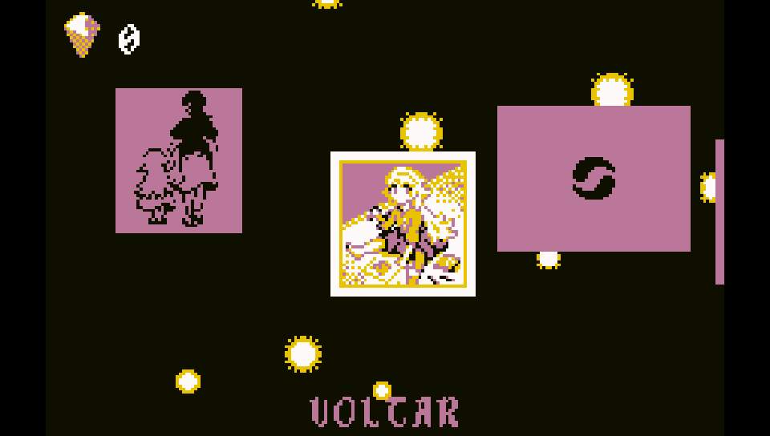
</p>
<p align="center">
  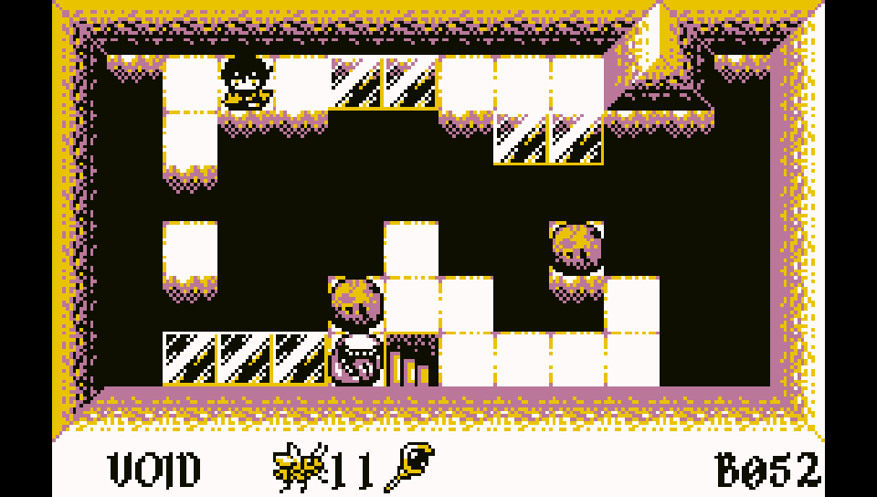
  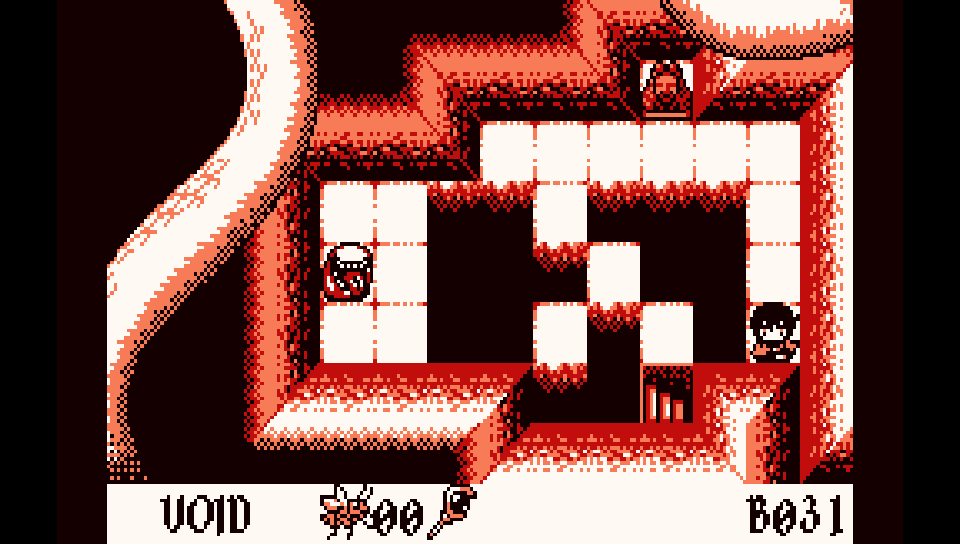
</p>
<p align="center">
  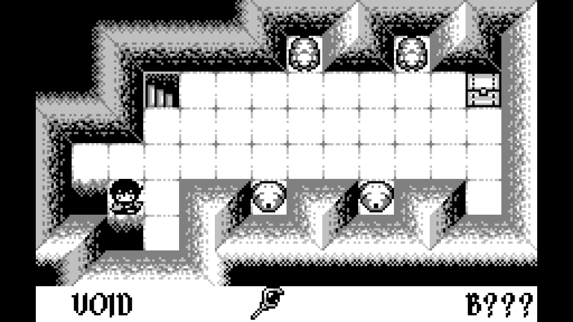
</p>

## How It Works

Void Stranger Vita does not emulate Windows or run the original Windows executable. It reads the official GameMaker data and executes it through a customized native runner:

```text
Official Void Stranger 1.1.3 Steam files
                  |
                  v
        Void Stranger Vita Patcher
                  |
                  v
          Vita-compatible data.win
                  |
                  v
        Customized Butterscotch
                  |
                  v
          VitaGL + OpenAL
                  |
                  v
              PS Vita
```

Texture pages are decoded from the active `data.win` on the Vita. BC3-compatible pages are compressed and cached as PVR data, while pages that need a lossless/UI-safe path use RGBA4444 caching. A fingerprint tied to `data.win` prevents stale caches from being reused after a rebuild.

## Build Instructions (For Developers)

### Requirements

- Windows 10 or 11;
- PowerShell 5.1 or newer;
- Docker Desktop with Linux containers enabled;
- Git;
- an official and unmodified Steam installation of Void Stranger 1.1.3.

Place the official game files under:

```text
data/Void.Stranger.v1.1.3/
```

Prepare the Vita data:

```powershell
powershell -ExecutionPolicy Bypass -File .\scripts\prepare-voidstranger-data.ps1 -Force
```

Build the VPK:

```bat
run_build.cmd
```

The VPK is generated at:

```text
artifacts/VoidStranger.vpk
```

The prepared data is generated at:

```text
data/prepared/voidstranger/
```

### Building the Windows patcher

The patcher project is located at:

```text
artifacts/Patcher/Build_Patch/
```

Run:

```bat
Build_Patcher.bat
```

The build process regenerates the binary `data.win` patch, embeds the optimized audio and supported language files, then creates `VoidStrangerVitaPatcher.exe` with PyInstaller.

> [!IMPORTANT]
> Commercial Void Stranger data must never be committed or distributed. Releases should contain only the VPK, patcher/patch data and other files required to transform a legitimate Steam installation.

## Credits

Void Stranger Vita exists because of the work, research and patience of several people and projects:

| Project / contributor | Contribution |
| :--- | :--- |
| **distheusurper2** | Extensive real-hardware testing, detailed issue reports and repeated validation throughout development. His patience and kindness made a large part of v2.0 possible; this project is as much his as mine, even if he would rather not take the credit. |
| [System Erasure](https://store.steampowered.com/app/2121980/Void_Stranger/) | Creators of **Void Stranger** and the original game, art, audio and design on which this port depends. |
| [Butterscotch](https://github.com/ButterscotchRunner/Butterscotch) | GameMaker runner foundation used by the Vita port to execute the original Windows/Steam game data. |
| [VitaGL](https://github.com/Rinnegatamante/vitaGL) | Graphics layer used to bring the renderer to PS Vita hardware. |
| [Void Stranger International](https://github.com/GiAnMMV/Void-Stranger-International) | Foundation for the multilingual implementation and community language support. |
| [YoYo Loader Vita compatibility research](https://github.com/Rinnegatamante/YoYo-Loader-Vita-Compatibility/issues/1121) | Prior PS Vita/GameMaker compatibility research and technical reference material. |
| [sinister-kid/voidstranger_vita](https://github.com/sinister-kid/voidstranger_vita) | Earlier community work and reference material for running Void Stranger on PS Vita. |

Void Stranger and its assets belong to their respective owners. This is a community-made project and is not affiliated with System Erasure.
